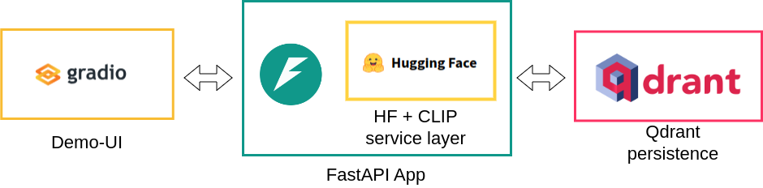
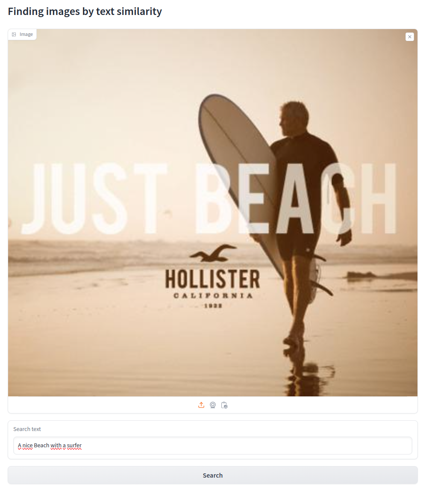

# Text-image similarity search with Qdrant

## The problem
We want to build a service that matches text queries to images that depict semantically similar content.

## Text-image similarity with CLIP

One of the most popular models for learning visual concepts from natural language was created by OpenAI researchers and is called CLIP (Contrastive Language–Image Pre-training). The key idea is to learn common representations by training two transformer-based encoder models on a large dataset of image-text pairs. The contrastive pre-training combined with the scaled up dataset results in a strong representation ability of both models.


The resulting pair of encoder models can be used for a variety of different tasks such as zero-shot classification of images and feature extraction. Recently, it has also found application in multimodal large language models such as LLaVa or CogVLM.

Therefore CLIP is selected as a viable pre-trained model to solve the problem at hand. In practice we will use the image encoder to create an embedding that represents the semantic content of the image. This embedding is stored in Qdrant instance along with the image as payload. At query time the text encoder is used to convert the query text into an embedding vector. This vector is then used retrieve the most similar image.

## Proposed solution

The solution uses the transformers library by Hugging Face with `openai/clip-vit-large-patch14` as pre-trained model. The application implements a simple REST-API that can be queried with search text and returns the most similar image.

### Architecture

The backend is implemented using a FastAPI app encapsulating a python service layer. The service layer implements the model inference which generates the embeddings for images and query texts. The FastAPI app exposes a a single endpoint that expects a string and returns the corresponding image from the Qdrant instance.



To demonstrate the functionality a UI using Gradio was implemented. This UI connects to the FastAPI app via REST.

### Running the application

#### Running Qdrant

It is assumed that the test system has running Docker daemon which does not require root access and current dir is in the root of this repository. To start a local Qdrant instance via docker:
```bash
docker run -d -p 6333:6333 -v `pwd`/storage:/qdrant/storage qdrant/qdrant 
```

#### Ingesting data

We will be using the `Advertisement Image Dataset`. Download and unzip as follows:
```bash
wget https://storage.googleapis.com/ads-dataset/subfolder-0.zip -P ./data
unzip data/subfolder-0.zip -d data/

wget https://storage.googleapis.com/ads-dataset/subfolder-1.zip -P ./data
unzip data/subfolder-1.zip -d data/
```

In order to install the required dependencies run:
```bash
pip install -r ./requirements.txt
```

To ingest the data from the previously downloaded dataset we will use the `ingest.py` script.

```bash
python ingest.py -c image_collection -i ./data/0
```

The script creates a new collection called `image_collection` and ingests all images in `./data/0`. The database url defaults to `http://localhost:6333`. Run `python ingest.py --help` for more options.

Here it is assumed that there is a GPU available to run the CLIP model.


#### Running the application

To start the service application run the following command:
```bash
COLLECTION="image_collection" python txt2image/txt2image_service.py
```
One can set additional env vars `URL`, `API_KEY` and `DEVICE` to set the corresponding settings.


#### Running the Gradio demo

The following command starts the Gradio UI:
```bash
python demo.py
```
To access the web interface open `http://127.0.0.1:7860` in your browser. When hitting the Search button the most similar image from the database according to search text is returned.



## Limitations of CLIP

Limitations of CLIP are observed on tasks which are more abstract for example counting. Since the resolution is relatively limited, fine-grained classification using CLIP features shows limited performance.

On the present dataset I was not able to contruct text queries that demonstrate clearly failing examples. However I am sure that for sufficently complex text queries the retrieval accuracy will be limited. Espcially when fine-grained visual features are important.

## Evaluation

To evaluate the performance of a search system one can use different metrics. However the basis for any evaluation is a set of robust ground truth labels. For example for each image one could assign a human annotated image caption and unique ID.

Given the label structure described above one can then perform retrievals on a held out test dataset. As each retrieved image now is accompanied with the ID of the query we can assign true positive outcome for various metrics. For example retrieve the ten most similar images and check if the ground truth ID is found in the retrieved IDs. This would allow the calculation of `Precision@K` or `Recall@K` (where `K=10` in this case).

## Possible improvements

A simple improvement would be the extension of the query endpoint to accept the number of images to be returned. This would be helpful when evaluating on a dataset for different `K`. In a production setting one would also add more query validation and error handling.

Currently images are stored as a base64 string in the payload of each point in a Qdrant collection. Depending on the deployment setting this can have negative consequences on the performance of the database as the images create a huge memory overhead. Instead one could store the image artefacts in an object store (such as `S3`) with a unique ID and add the ID to payload when adding a new entry to a Qdrant collection. However this can create other drawbacks such as implementation overhead and retrieval latency from the object store.

Another option to improve retrieval latency is to add a caching layer. When using inference servers such as NVIDIA Triton, the implementation of such caching is straight forward.

